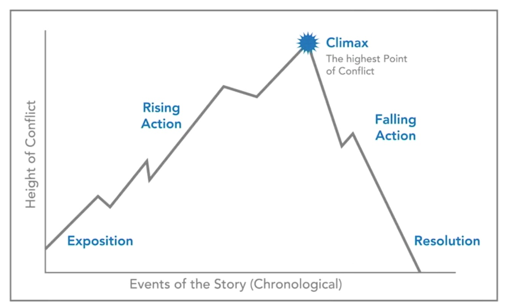
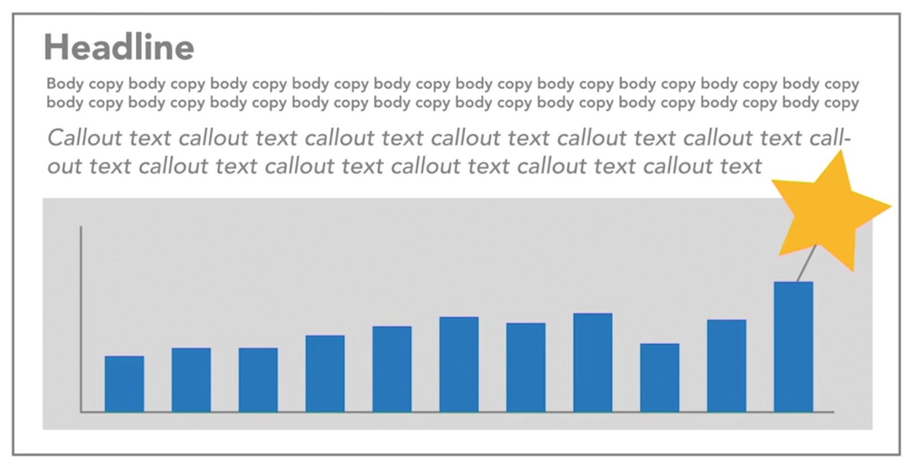

# Data Visualization: Storytelling

## Table of Contents
- [Data Visualization: Storytelling](#data-visualization-storytelling)
  - [Table of Contents](#table-of-contents)
  - [**Section 1: Why Storytelling**](#section-1-why-storytelling)
    - [Humans are wired for story](#humans-are-wired-for-story)
    - [Storytelling is essential](#storytelling-is-essential)
    - [Use story even when you don't](#use-story-even-when-you-dont)
    - [Knowledge check](#knowledge-check)
      - [What is the evolutionary advantage to storytelling and what is one technique you can use to maximize the impact of your stories?](#what-is-the-evolutionary-advantage-to-storytelling-and-what-is-one-technique-you-can-use-to-maximize-the-impact-of-your-stories)
  - [**Section 2: Story Structure**](#section-2-story-structure)
  - [**Section 3: Story Mechanisms**](#section-3-story-mechanisms)
  - [**Section 4: Final Touches**](#section-4-final-touches)

## **Section 1: Why Storytelling**

### Humans are wired for story

- [Useful Fictions: Evolution, Anxiety, and the Origins of Literature](https://www.amazon.sg/Useful-Fictions-Evolution-Anxiety-Literature/dp/0803230265)
  - Produce and neutralize anxiety
  - Successful narratives introduce and then resolve our anxiety
- [Wired for Story: The Writer's Guide to Using Brain Science to Hook Readers from the Very First Sentence](https://www.amazon.sg/Wired-Story-Writers-Science-Sentence/dp/1541467205)
  - Stories activate the same parts of our brains that are activated when processing real sights, sounds, tastes, and movements in real life.

Fiction vs nonfiction (journalistic or documentary storytelling, or data storytelling)

- Stories like these aren't about suspending disbelief, rather they're about actuating a belief - Kim Rees
- Storytelling helped early man survive
- The evolutionary imperative is clear
- Think like a Storyteller

**[⬆ back to top](#table-of-contents)**

### Storytelling is essential

- Many studies have shown that humans spend 70 to 80% of their waking hours communicating
- Communication is the #1 desired skill
- A story is 22 times more memorable then facts alone - Jennifer Aaker

Statistics

- 21% of children under the age of 18 live below the poverty line in the US

Statistics and a story

- Try to remember your elementary school. 
- In my school, we had 100 kids in the class, broken into five classrooms of exactly 20 kids each. I remember my best friend Tom used to bring in an apple every day of school. But I know his family was poor so I never understood how or why they spent their money that way. 
- Last year, I found out that 21% of kids live below the poverty line in the US. I didn't grow up poor, so I don't think of it as being my first grade class. But since Tom was pretty poor, I think about him. I think about how every single kid in his first grade class, all 20 kids, one in five of all of us at that school, might've been living in poverty given that number.

- Neutral words (chair) activate the language portion of our brains
- Other words (coffee) activate parts of our brains involved in processing senses
- The more different parts of the brain that are activated, the more memorable and emotional and impactful a story is
- Statistics are like the neutral words

So weaving in statistics with story, and including details like the apple Tom brought in for his teacher every day, activates more portions of the brain, creating more sensory inputs (Feel, Think and See), and therefore stickier and more impactful content.

[Narrative Visualization: Telling Stories with Data](http://vis.stanford.edu/files/2010-Narrative-InfoVis.pdf)

Author driven vs. reader driven

- Reader driven
  - A purely reader-driven approach has no prescribed ordering of images, no messaging, and a high degree of interactivity
  - Purely reader driven visualizations are not data stories at all. They're dashboards. 
  - They're great for when you're sharing data with experts or people who need to explore data directly. 
  - They don't need to be told a narrative. 
  - They don't need explanations. 
  - They're really doing analysis. 
  - It's a tool they'll be using repeatedly, not really a communications device.
- Author driven
  - Data stories appear to be most effective when they have constrained interaction at various checkpoints within a narrative, allowing the user to explore the data without veering too far from the intended narrative
  - In other words, they're not exploration tools. 
  - But rather narrative experiences that provide context and direction, not just a pile of numbers and charts.

**[⬆ back to top](#table-of-contents)**

### Use story even when you don't

- In its most basic form, every story needs a beginning, middle, and end. 
- A story has some more nuance things like the challenge the protagonist faces and the climax that everything builds up to. 

- The yellow highlight is the conclusion of the story, the end
- The headline is the beginning of the story. 
- The body copy maybe is the middle
- The callout text, let's say is the climax. 
- headlines, callouts, highlighted areas are great opportunities to introduce that key ingredient, anxiety.

**[⬆ back to top](#table-of-contents)**

### Knowledge check

#### What is the evolutionary advantage to storytelling and what is one technique you can use to maximize the impact of your stories?

Stories feel like reality and they help us experience, and then resolve, anxiety - teaching us how to handle difficult situations. Activate your audience's sentences by using words that trigger different parts of the brain (like smell and taste).

**[⬆ back to top](#table-of-contents)**

## **Section 2: Story Structure**
**[⬆ back to top](#table-of-contents)**

## **Section 3: Story Mechanisms**
**[⬆ back to top](#table-of-contents)**

## **Section 4: Final Touches**
**[⬆ back to top](#table-of-contents)**
