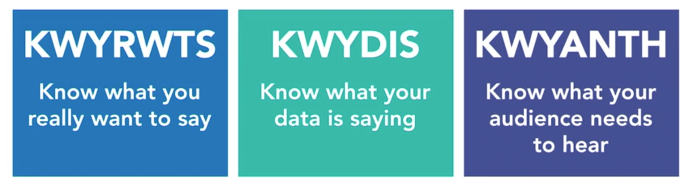
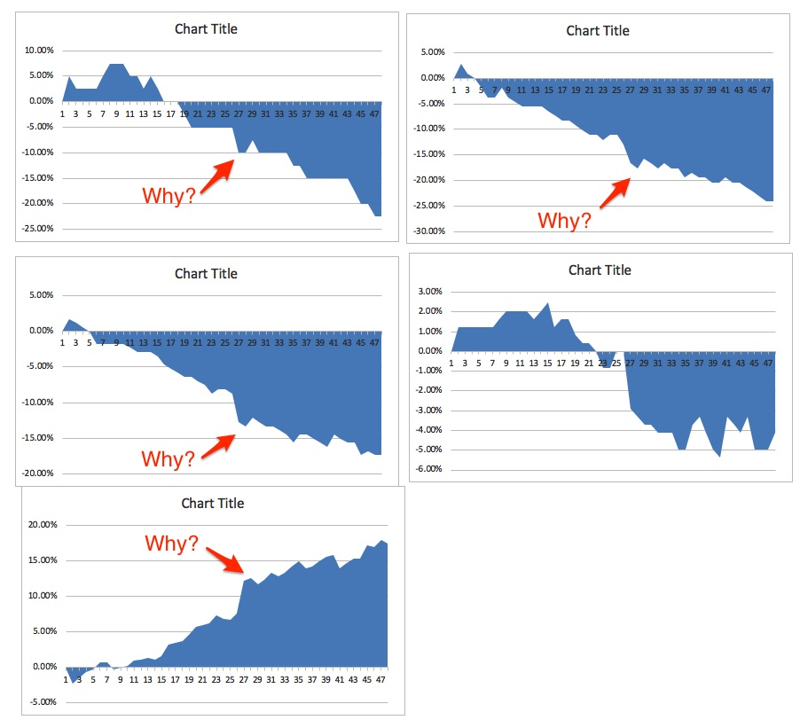
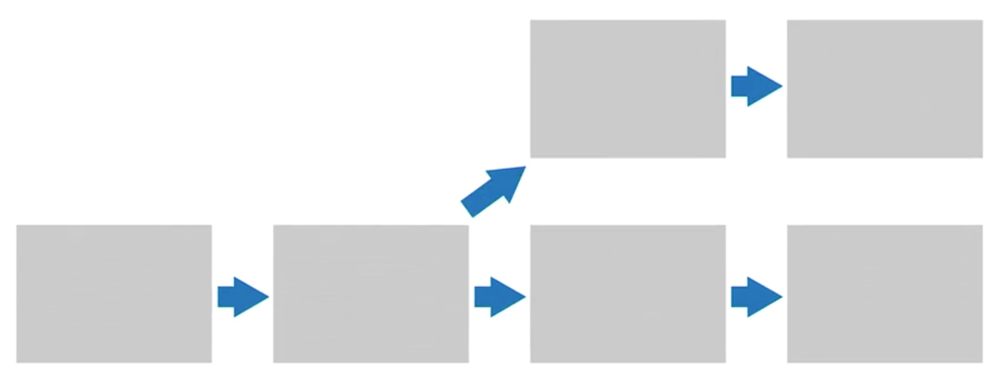
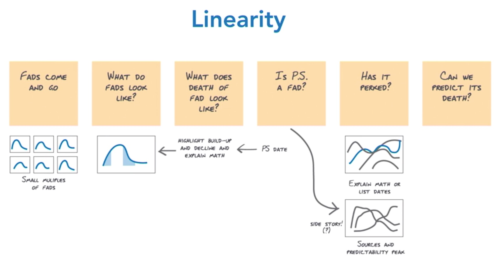
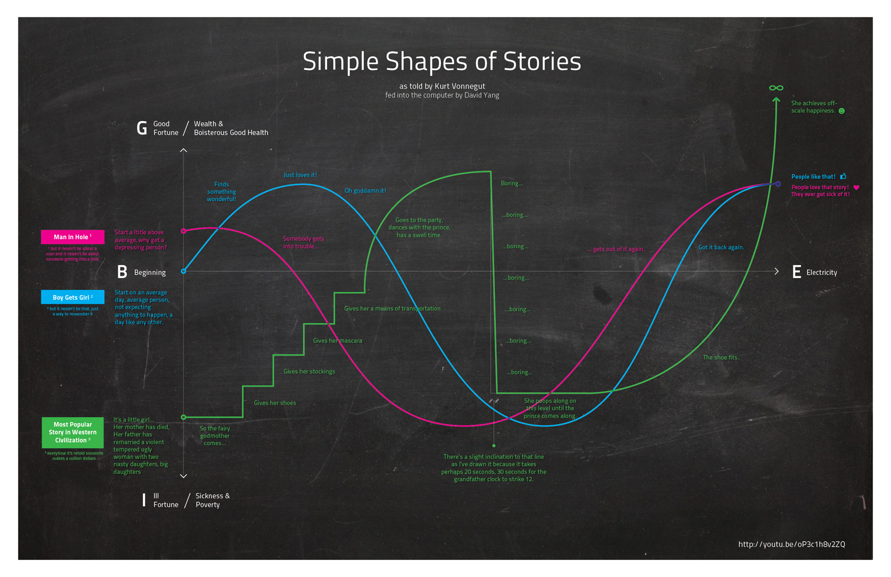
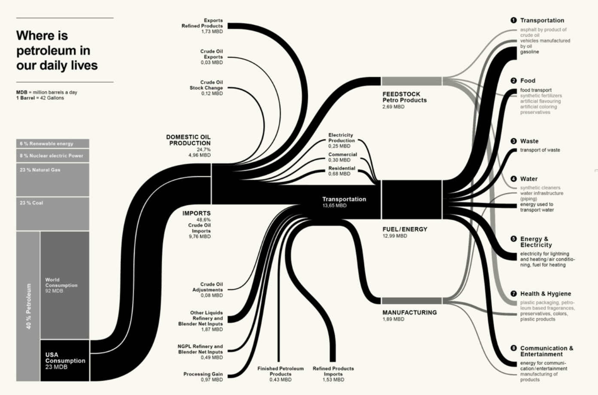
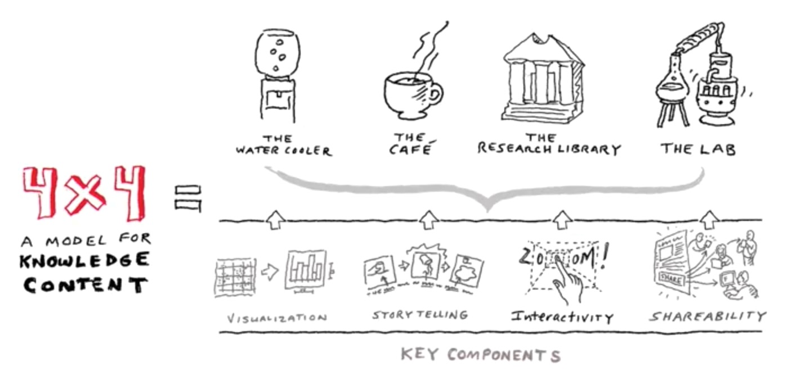
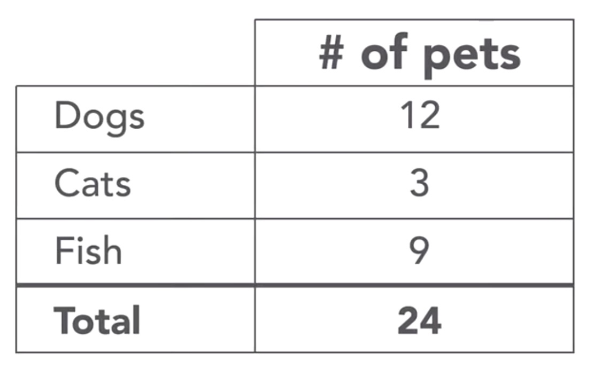

# Data Visualization: Storytelling

## Table of Contents
- [Data Visualization: Storytelling](#data-visualization-storytelling)
  - [Table of Contents](#table-of-contents)
  - [**Section 1: Why Storytelling**](#section-1-why-storytelling)
    - [Humans are wired for story](#humans-are-wired-for-story)
    - [Storytelling is essential](#storytelling-is-essential)
    - [Use story even when you don't](#use-story-even-when-you-dont)
    - [Knowledge check](#knowledge-check)
      - [What is the evolutionary advantage to storytelling and what is one technique you can use to maximize the impact of your stories?](#what-is-the-evolutionary-advantage-to-storytelling-and-what-is-one-technique-you-can-use-to-maximize-the-impact-of-your-stories)
  - [**Section 2: Story Structure**](#section-2-story-structure)
    - [KWYRWTS](#kwyrwts)
    - [Story structure](#story-structure)
    - [Find the story in your data](#find-the-story-in-your-data)
    - [Sketch and storyboard](#sketch-and-storyboard)
    - [Knowledge check](#knowledge-check-1)
      - [What are 3 goals for storytelling and sketching?](#what-are-3-goals-for-storytelling-and-sketching)
  - [**Section 3: Story Mechanisms**](#section-3-story-mechanisms)
    - [Linear logic](#linear-logic)
    - [Change over time](#change-over-time)
    - [Flow diagrams](#flow-diagrams)
    - [Compare and contrast](#compare-and-contrast)
    - [Progressive depth](#progressive-depth)
    - [Personalization](#personalization)
    - [Text](#text)
    - [Knowledge check](#knowledge-check-2)
      - [Name 2 story mechanisms and at least one argiment for using each kind. Try to use an example of a data story that takes advantage of that mechanism to give your answer context.](#name-2-story-mechanisms-and-at-least-one-argiment-for-using-each-kind-try-to-use-an-example-of-a-data-story-that-takes-advantage-of-that-mechanism-to-give-your-answer-context)
  - [**Section 4: Final Touches**](#section-4-final-touches)

## **Section 1: Why Storytelling**

### Humans are wired for story

- [Useful Fictions: Evolution, Anxiety, and the Origins of Literature](https://www.amazon.sg/Useful-Fictions-Evolution-Anxiety-Literature/dp/0803230265)
  - Produce and neutralize anxiety
  - Successful narratives introduce and then resolve our anxiety
- [Wired for Story: The Writer's Guide to Using Brain Science to Hook Readers from the Very First Sentence](https://www.amazon.sg/Wired-Story-Writers-Science-Sentence/dp/1541467205)
  - Stories activate the same parts of our brains that are activated when processing real sights, sounds, tastes, and movements in real life.

Fiction vs nonfiction (journalistic or documentary storytelling, or data storytelling)

- Stories like these aren't about suspending disbelief, rather they're about actuating a belief - Kim Rees
- Storytelling helped early man survive
- The evolutionary imperative is clear
- Think like a Storyteller

**[⬆ back to top](#table-of-contents)**

### Storytelling is essential

- Many studies have shown that humans spend 70 to 80% of their waking hours communicating
- Communication is the #1 desired skill
- A story is 22 times more memorable then facts alone - Jennifer Aaker

Statistics

- 21% of children under the age of 18 live below the poverty line in the US

Statistics and a story

- Try to remember your elementary school. 
- In my school, we had 100 kids in the class, broken into five classrooms of exactly 20 kids each. I remember my best friend Tom used to bring in an apple every day of school. But I know his family was poor so I never understood how or why they spent their money that way. 
- Last year, I found out that 21% of kids live below the poverty line in the US. I didn't grow up poor, so I don't think of it as being my first grade class. But since Tom was pretty poor, I think about him. I think about how every single kid in his first grade class, all 20 kids, one in five of all of us at that school, might've been living in poverty given that number.

- Neutral words (chair) activate the language portion of our brains
- Other words (coffee) activate parts of our brains involved in processing senses
- The more different parts of the brain that are activated, the more memorable and emotional and impactful a story is
- Statistics are like the neutral words

So weaving in statistics with story, and including details like the apple Tom brought in for his teacher every day, activates more portions of the brain, creating more sensory inputs (Feel, Think and See), and therefore stickier and more impactful content.

[Narrative Visualization: Telling Stories with Data](http://vis.stanford.edu/files/2010-Narrative-InfoVis.pdf)

Author driven vs. reader driven

- Reader driven
  - A purely reader-driven approach has no prescribed ordering of images, no messaging, and a high degree of interactivity
  - Purely reader driven visualizations are not data stories at all. They're dashboards. 
  - They're great for when you're sharing data with experts or people who need to explore data directly. 
  - They don't need to be told a narrative. 
  - They don't need explanations. 
  - They're really doing analysis. 
  - It's a tool they'll be using repeatedly, not really a communications device.
- Author driven
  - Data stories appear to be most effective when they have constrained interaction at various checkpoints within a narrative, allowing the user to explore the data without veering too far from the intended narrative
  - In other words, they're not exploration tools. 
  - But rather narrative experiences that provide context and direction, not just a pile of numbers and charts.

**[⬆ back to top](#table-of-contents)**

### Use story even when you don't

- In its most basic form, every story needs a beginning, middle, and end. 
- A story has some more nuance things like the challenge the protagonist faces and the climax that everything builds up to. 

- The yellow highlight is the conclusion of the story, the end
- The headline is the beginning of the story. 
- The body copy maybe is the middle
- The callout text, let's say is the climax. 
- headlines, callouts, highlighted areas are great opportunities to introduce that key ingredient, anxiety.

**[⬆ back to top](#table-of-contents)**

### Knowledge check

#### What is the evolutionary advantage to storytelling and what is one technique you can use to maximize the impact of your stories?

Stories feel like reality and they help us experience, and then resolve, anxiety - teaching us how to handle difficult situations. Activate your audience's sentences by using words that trigger different parts of the brain (like smell and taste).

**[⬆ back to top](#table-of-contents)**

## **Section 2: Story Structure**

### KWYRWTS

- KWYRWTS stands for Know What You Really Want To Say
- "What's the story in the data?" 
- You have to get the actual message together before you can tell a story.
- KWYDIS stands for know what your data is saying.
- You need to know what you want to focus on, but you need to really investigate the data and discover what stories are available to you in your data.
- KWYANTH stands for Know what your audience needs to hear

- Get to the single idea or the fives ideas of the eight ideas you need to communicate. 
- Know which is the most important and which is the least
- Have your core message and thoughts organized
- Tell the story around those concepts

Example: [Global brand-simplicity-index-2015](https://www.slideshare.net/clhayes1110/global-brandsimplicityindex2015)

- They knew what they really wanted to say. 
- It's all about simplicity, even though they look at it from many, many different directions.

**[⬆ back to top](#table-of-contents)**

### Story structure

- A story is how what happens affects someone who is trying to achieve what turns out to be a difficult goal and how he or she changes as a result - Lisa Cron
  - how what happens, that's the plot
  - affects someone, the protagonist, who's trying to achieve what turns out to be a difficult goal, this is the story problem, 
  - the challenge the protagonist faces,
  - how he or she changes as a result, the so what.

- The other critical aspect of a good story is anxiety. That story problem and that transformation is always experienced by the reader as anxiety and the resolution of anxiety. - Micheal Austin

- Storytelling for thousands of years was purely oral tradition.
- Then came drawings on cave walls. 
- Stories are linear, step-by-step things. 
 
What does linearity do? 

- Primarily, linear storytelling
- starting at the beginning and moving to a conclusion, mimics real life.
- The beginning sets the context for what we're about to hear,
- The middle explains what's going on, allowing us to wander and explore the universe of ideas being presented and get introduced to the anxieties that need resolving,
- The conclusion, resolves those anxieties, teaching us how to solve problems and what transformation characters have to go through to do so.

**[⬆ back to top](#table-of-contents)**

### Find the story in your data

Income distribution exercise

- [Share of Aggregate Income Received by Each Fifth and Top 5 Percent of Households](https://www.census.gov/data/tables/time-series/demo/income-poverty/historical-income-households.html)
- Refer to 02_03.xls

**[⬆ back to top](#table-of-contents)**

### Sketch and storyboard

- Vet and Test: Experimentation is your friend - you want to try your ideas, see what doesn't fail
- Structure: What are the order, the information hierarchy and pace?
- Speed: Move quickly, fail fast and often, sketch, don't strive for perfection.

- The only way I've found to do real trial and error with this type of work, is to work using your hands, not a computer. 
- In other words, break out a pen and paper, or a white board.

Storyboarding = finding structure

- Storyboarding is the part where you're figuring out the structure and order of your story. 
- Assuming you are creating a linear story, the idea is to figure out what comes first, what's in that piece of the story, then what happens? And then what after that? 
- You have a series of panels, and the idea is to fill in the panels with the basic idea, for each story segment.
- See exactly how the story's gonna come to life

Storyboard In Practice #1

Storyboard In Practice #2

- [Dear Data](http://www.dear-data.com)

Except sometimes, your storyboarding and sketching is gonna reveal to you, that you have a great idea, and a great story, but your data just doesn't support your ideas.

Conclusion

- Work in analog, use your hands
- Organize your story structure, experiment a lot
- Fail a lot, test your ideas every step of the way.

**[⬆ back to top](#table-of-contents)**

### Knowledge check

#### What are 3 goals for storytelling and sketching?

- vet & test your ideas
- figure out the structure and hierarchy of your story
- fail quickly and try again

**[⬆ back to top](#table-of-contents)**

## **Section 3: Story Mechanisms**

### Linear logic

- Humans can only do one thing at a time as much as we like to think we can multitask. 
- It's even more true that humans can only thoughtfully perceive one thing at a time, so providing one experience at a time in a step-by-step linear fashion makes perfect sense.

[Kurt Vonnegut on the Shapes of Stories](https://www.youtube.com/watch?v=oP3c1h8v2ZQ)

[The fallen of WW2](http://www.fallen.io/ww2)

**[⬆ back to top](#table-of-contents)**

### Change over time

- Time-driven linear story
- Example: Story of Napoleon's march on Moscow

**[⬆ back to top](#table-of-contents)**

### Flow diagrams

**[⬆ back to top](#table-of-contents)**

### Compare and contrast

- An Inconvenient Truth By Al Gore
- Alternate realities
- This vs That
- Compare apples to apples
- [selfiecity](http://selfiecity.net)

**[⬆ back to top](#table-of-contents)**

### Progressive depth

- present simple, higher level information to people to get them to self-select in for deeper and more complex content, based on their interest in the subject matter.

[4X4 Model for Knowledge Content](https://medium.com/@billshander/4x4-model-for-knowledge-content-575cc7f24601)

- Attract the right audience

**[⬆ back to top](#table-of-contents)**

### Personalization

- Storytelling is a narcissistic thing.
- Try to create stories consciously, that connect directly to your audience, and their need to understand certain things. 
- The best way is to literally allow them to make the story about themselves via interactivity.
- Example: [Nicholas Felton](http://feltron.com/FAR14.html)
- Example: [Visualizing MBTA Data](http://mbtaviz.github.io)

**[⬆ back to top](#table-of-contents)**

### Text

- [Nine Charts about Wealth Inequality in America](https://apps.urban.org/features/wealth-inequality-charts)
- Think like a journalist

**[⬆ back to top](#table-of-contents)**

### Knowledge check

#### Name 2 story mechanisms and at least one argiment for using each kind. Try to use an example of a data story that takes advantage of that mechanism to give your answer context.

- Linear Logic - humans can only do one thing at a time fits with your expectations and most common experiences with stories
- Progressive Depth - when people want more information, you can give it to them, like in the EYP example, by offering clickable features for a deeper experience.

**[⬆ back to top](#table-of-contents)**

## **Section 4: Final Touches**
**[⬆ back to top](#table-of-contents)**
